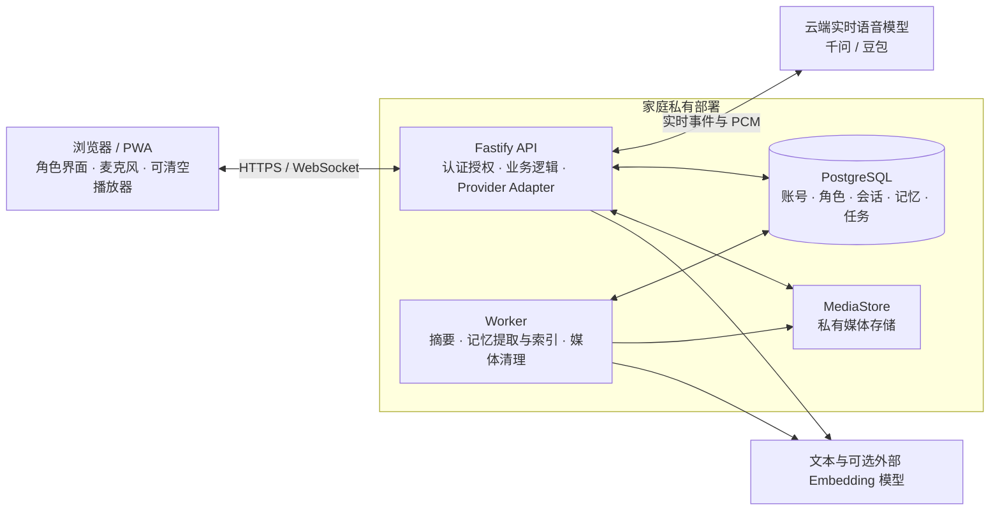

# Meet

Meet 是一个私有部署、供家庭内部使用的 AI 实时语音角色应用。家庭成员可以与有稳定人设、固定声音和长期记忆的角色自然交谈，用于陪伴、学习和角色扮演。

项目面向手机和平板，兼容桌面浏览器，并提供可安装的 PWA。一个部署实例服务一个家庭，每位成员独立登录；实时推理使用云端模型，对话记录、角色和记忆由自己的部署环境保存。

## 设计理念

### 自然对话优先

Meet 首先关注对话自然度、插话体验、人设稳定和中文口语表现。通话默认免提，使用语义轮次判断，并保留按住说话和手动停止作为备用操作。界面围绕角色展开：静态立绘、轻量状态动画、当前字幕和固定控制栏，减少交谈时的操作负担。

功能取舍也遵循这一顺序。第一版采用静态形象和供应商预设声音，把开发重点放在语音与连续对话上；手机和平板使用同一套页面，儿童与成人共用交互结构，通过服务端权限区分可用操作。

### 让角色与关系保持连续

角色的人设、对话策略、声音和视觉配置分别保存。人设默认使用可解释的结构化角色卡，也允许高级用户维护完整 Prompt。共享角色拥有全家一致的声音，各成员与角色形成的私人关系则相互独立。

再次通话默认承接过去的摘要与长期记忆，也可以选择临时对话。临时对话会保留本次文字历史，但不加载以前的私人关系，也不生成长期记忆。明确、可信的稳定事实可以自动保存；不确定内容进入待确认列表，用户可以审阅、编辑或删除。

### 家庭共享与个人隐私并存

管理员创建家庭成员账号，所有成员统一使用用户名和密码登录。每台设备只保持一个账号，切换成员需要先退出。预置角色和管理员创建的角色全家共享，成人创建的角色默认私有，可以主动分享；儿童只能使用家庭公共角色。

成人的私人历史和记忆仅本人可读。管理员能否查看儿童的私人内容由该儿童账号单独配置，默认允许。成人配置学习计划的权限不会扩大其对儿童对话的读取权限。这些限制由 API 和数据查询执行。

### 学习融入聊天，儿童始终可以拒绝

“学习小支线”让成人按儿童和角色设置短期目标，由独立文本模型生成活动草稿，成人查看题目、答案、讲解和反馈后确认启用。儿童进入通话前会看到说明，可以选择“本次只聊天”，也可以主动请求一个小挑战。

支线默认关闭，每次通话最多一个活动、最多两次角色回复，随后回到普通聊天。明确拒绝后本次不再主动邀请。当前内容标记为“模型生成 · 未联网”，需要成人核对；系统不生成分数、能力画像或成绩报告。

### 数据由应用掌握，模型能力可以替换

角色、会话、记忆和媒体的归属由 Meet 管理，供应商通过适配器接入。管理员可以分别配置实时语音、摘要、记忆提取、学习计划生成和记忆向量化用途。模型故障时只重试原配置，持续失败则暂停并提供重试或结束操作。

供应商之间的能力差异会明确保留。新增适配器需要验证协议和运行边界，不把某个模型的实验结果视为其他模型也已通过验证。

## 核心功能与当前进展

项目处于 MVP 业务开发阶段。下表列出已经接入的产品能力；真实设备上的自然度、延迟、外放回声和长通话体验仍在持续验收。

| 领域       | 当前能力                                                                                                     |
| ---------- | ------------------------------------------------------------------------------------------------------------ |
| 家庭账号   | 管理员初始化、成人与儿童账号创建、独立登录、修改密码、管理员重置密码、儿童历史访问开关                       |
| 角色       | 星盾队长、林老师、知夏三个预置角色；创建、编辑、复制、删除、分享与预置恢复；结构化人设和完整 Prompt 两种模式 |
| 形象与声音 | 内置形象、上传 JPG/PNG/WebP，已启用模型与音色选择、固定短句试听                                              |
| 实时通话   | 千问 Plus/Flash 与豆包全双工适配、免提与按住说话、字幕、语义打断、手动停止、约 30 秒断线恢复、长通话主动续接 |
| 历史与记忆 | 已确认文字幂等保存、历史回看与续聊、会话摘要、长通话增量摘要、长期记忆提取与审阅、可选 Mem0 语义索引与诊断   |
| 学习小支线 | 成人配置、模型生成短期计划、完整预览与确认、儿童说明与拒绝控制；动态执行限定在显式批准的千问配置             |
| 关系迁移   | 按“当前账号 × 当前角色”导出、导入文字历史、摘要和长期记忆，重复导入不重复写入                                |
| 媒体与 PWA | 私有媒体元数据、授权读取和清理基础；可安装 PWA、应用外壳缓存、新版本刷新提示                                 |

预置角色初始化后即可在首页查看，通话前仍需管理员配置、测试并启用实时模型。录音采集与回放、拍题与教学辅助、AI 角色生成和角色卡定义导入导出尚未形成完整产品流程，见下方[后续重点](#后续重点)。

## 整体技术方案

前后端统一使用 TypeScript，采用 pnpm workspace Monorepo。Web 处理交互和实时音频，API 执行权限、业务持久化和供应商中继，Worker 处理摘要、记忆与媒体清理。



| 层次     | 技术与职责                                                                             |
| -------- | -------------------------------------------------------------------------------------- |
| Web      | React + Vite + `vite-plugin-pwa`；移动优先，使用同一前端承载成员和管理员功能           |
| API      | Fastify + `@fastify/websocket`；身份校验、业务 API、同源实时中继及模型适配             |
| 协议     | Zod schema 作为运行时事实来源，推导前后端共享 TypeScript 类型                          |
| 数据     | PostgreSQL + Drizzle ORM；保存权威业务记录、版本、权限与幂等状态                       |
| 后台任务 | `pg-boss` 与现有 PostgreSQL；独立 Worker 执行可重试任务，无需 Redis                    |
| 媒体     | 所有读写经过 MediaStore；默认本地私有目录，保留注入式 S3 兼容客户端边界                |
| 语义记忆 | 可选 Mem0 OSS 嵌入 API/Worker，同库 pgvector 索引；支持本地 FastEmbed 或外部 Embedding |

当前仓库结构：

```text
apps/
├── web/          # PWA、角色与通话界面、音频采集和播放
├── api/          # 认证、业务接口、模型配置与实时中继
└── worker/       # 摘要、记忆、索引和媒体清理任务
packages/
├── protocol/     # Zod schema 与共享类型
├── database/     # Drizzle schema、迁移与数据访问
├── jobs/         # 后台任务协议与队列封装
├── media/        # MediaStore 与存储实现
└── memory/       # 语义记忆索引与 Embedding 集成
docs/            # 产品需求、架构、决策、配置指南和技术验证
```

### 实时语音与长通话

当前产品链路采用浏览器 → 同源 API → 供应商的 WebSocket 中继。浏览器发送 16 kHz PCM，消费供应商返回的 24 kHz PCM；播放队列按响应 ID 和本地播放版本管理。插话时先清空旧音频，再处理上游取消，避免字幕已切换而旧回复继续播放。WebRTC 保留为实验与诊断路径。

一次业务通话可以跨越多条供应商连接。首次握手固定角色、模型、音色和上下文策略快照，之后的恢复继续使用该快照。单连接约 28 分钟或累计 20 个有效用户轮次后，系统安排主动续接：等待双方空闲、音频播完和字幕保存后重建连接，承接原话题且不重复开场。准备期间再次开口会取消本次切换；新连接仍可能有短暂握手停顿。

意外断线后约 30 秒内自动重试原模型，超时进入暂停。PWA 返回前台时尝试恢复；更新采用用户确认刷新，活跃通话中不自动重载页面。续接的确认、取消和失败边界见 [ADR-0037](docs/decisions/0037-proactive-realtime-session-renewal.md)。

### 上下文、记忆与持久化

1. **开始通话**：按账号和角色读取长期记忆、历史摘要与最近已确认文字，再按供应商预算装配上下文。
2. **交谈中**：已确认字幕用稳定 ID 与连续序号保存；达到消息数或字符阈值后异步生成增量摘要检查点。
3. **恢复或续接**：先补写未确认保存的文字，再加载最新成功检查点及其后的原文，继续同一业务会话。
4. **结束通话**：在完成会话的业务事务中创建摘要和记忆工作项；临时通话只生成本次摘要。
5. **后续回忆**：可选语义索引先返回候选本地记忆 ID，API 再回查 PostgreSQL 校验归属与状态后使用；索引不可用时回退到最近记忆。

PostgreSQL 中的记忆正文、来源和审阅状态始终是权威记录。索引可以重建，不能绕过账号权限，也不能让已拒绝或删除的记忆重新生效。未配置分析模型时工作项等待配置，不阻止通话文字保存。

### 学习计划与实时控制

计划生成发生在配置阶段，只向独立文本模型发送成人填写的学习目标及必要规则，不读取儿童对话、记忆或家庭资料。模型结果通过严格结构校验，成人确认后再由固定模板编译为受控活动。

实时阶段由服务端调度器控制次数、冷却、拒绝和生效时机。短期指令与基础角色快照分开管理，应用和恢复都等待供应商确认。当前动态教学只对精确加入允许列表的千问 Plus/Flash 模型配置与连接修订生效；配置变化后重新验证，其他角色仍可保存待生效计划。

## 数据与部署边界

- 对话、摘要、长期记忆默认按账号与角色隔离。关系迁移只允许导出当前账号自己的数据；迁移文件包含私人文字，使用者需要妥善保管。
- 供应商 API Key 保存在私有 PostgreSQL，当前方案为明文存储；浏览器和管理 API 不返回密钥内容，日志也不记录密钥。数据库与磁盘快照需要由部署者限制访问。
- 只向云端发送当前推理所需内容。本地 Embedding 模式在首次下载模型后于服务端执行；选择外部 Embedding 时，待索引记忆和召回查询会发送给所配置服务。
- 媒体通过带账号认证的 API 读取，不依赖永久公开链接。原始通话音频默认不长期保存，按次录音产品流程仍待接入。
- 应用不设置全局并发通话上限；服务器资源与供应商配额错误按会话处理。单连接资源限制不等同于整次通话时长限制。
- 域名、HTTPS、云服务器与磁盘快照由项目所有者管理。应用不提供全量备份恢复，也不承诺以端到端加密隔离拥有服务器和数据库控制权的人。

第一版范围不包含公开注册、多租户服务、公开角色市场、原生移动应用、离线 AI、持续摄像头、数字人、互动白板、Web Push 或角色主动来电。工具范围规划为计算器，暂不扩展联网搜索和通用外部操作。

## 本地运行与开发

环境要求：Node.js **22.12+**、pnpm **10** 和 PostgreSQL。普通运行不要求 pgvector；启用可选语义记忆索引时才需要安装该扩展。

先准备数据库与配置：

```bash
cp .env.example .env
pnpm install
```

在 PostgreSQL 中创建空数据库，并在 `.env` 填写 `DATABASE_URL`，然后运行：

```bash
pnpm db:migrate
pnpm admin:init --username admin --display-name 家庭管理员
pnpm dev
```

`admin:init` 需要先有表结构，因此在它之前执行 `pnpm db:migrate`。之后 API 启动时也会自动应用迁移。也可在 `.env` 配置 `INITIAL_ADMIN_USERNAME` 与 `INITIAL_ADMIN_PASSWORD`，跳过 `admin:init`，由 API 在空库首次启动时创建首位管理员。`pnpm dev` 同时启动 Web、API 和 Worker；默认从本机浏览器访问 `http://localhost:5173`。

首次登录后，在“我的 → 模型设置”录入供应商连接、模型和音色，完成测试、启用及实时默认绑定。预置推荐千问 `qwen-audio-3.0-realtime-plus`，也可以显式选用已启用的其他兼容配置。摘要、记忆提取和学习计划生成使用各自用途绑定。模型密钥不从 `.env` 导入。

手机或其他设备访问麦克风需要 HTTPS。示例 `AUTH_COOKIE_SECURE=false` 仅用于本地 HTTP 开发，生产 HTTPS 部署应改为 `true`。详细操作见[配置与运行指南](docs/setup.md)，包括模型设置、学习小支线、Mem0、密码恢复和关系迁移。

| 命令                                                | 用途                                         |
| --------------------------------------------------- | -------------------------------------------- |
| `pnpm dev`                                          | 同时启动 Web、API 与 Worker                  |
| `pnpm dev:web` / `pnpm dev:api` / `pnpm dev:worker` | 单独启动对应进程                             |
| `pnpm db:migrate`                                   | 显式应用数据库迁移（API 启动时也会自动执行） |
| `pnpm check`                                        | 格式、Lint、类型、自动测试和生产构建完整检查 |
| `pnpm admin:reset-password --username admin`        | 在服务器终端重置管理员密码并撤销旧会话       |
| `pnpm release` / `pnpm release 0.2.0`               | 升 patch 或指定版本，打 `vX.Y.Z` tag 并推送  |

推送 `v*` tag 后，GitHub Actions 会构建并推送三个 GHCR 镜像：`ghcr.io/alexmaze/meet/api`、`…/worker`、`…/web`（另打 `X.Y` 与 `latest`）。完整容器部署步骤见下方 [Docker Compose 部署](#docker-compose-部署)。

自动测试覆盖确定性协议、权限、状态转换、持久化与错误恢复，不调用真实收费模型。真实 Provider Spike 使用独立验证流程，默认只生成 preflight；实际调用需要逐次授权、预算和完整计划哈希确认，见[技术验证方案](docs/spikes/realtime-dynamic-teaching-directives.md)。

## Docker Compose 部署

仓库提供 [`docker-compose.yml`](docker-compose.yml)，一次拉起 PostgreSQL、API、Worker 与 Web。Web 通过 [`docker/nginx.compose.conf`](docker/nginx.compose.conf) 把 `/api`（含 WebSocket）反代到 API，浏览器只访问 Web 端口即可。

生产域名、TLS 证书和云主机仍由部署者自行处理（见 [ADR-0015](docs/decisions/0015-deployment-responsibility.md)）；Compose 只负责应用进程与数据卷。

### 1. 准备环境文件

在仓库根目录（不要覆盖本地开发用的 `.env`）：

```bash
cp .env.compose.example .env.compose
```

至少修改：

| 变量 | 说明 |
| --- | --- |
| `MEET_VERSION` | 镜像版本，对应已发布 tag（如 `v0.1.1` 填 `0.1.1`）；也可用 `latest` |
| `POSTGRES_PASSWORD` | 数据库密码；勿使用 `@` `#` `:` `/` `?` 等会破坏连接串的字符 |
| `WEB_PUBLISH_PORT` | 本机访问端口，默认 `8080` |
| `AUTH_COOKIE_SECURE` | 本机 HTTP 试用为 `false`；前面有 HTTPS 反代时必须为 `true` |
| `INITIAL_ADMIN_USERNAME` / `INITIAL_ADMIN_PASSWORD` | 可选；空库首次启动 API 时创建首位管理员，须同时设置 |
| `INITIAL_ADMIN_DISPLAY_NAME` | 可选；默认与用户名相同 |

后续命令均带上 `--env-file .env.compose`。若 GHCR 包尚未设为 Public，需先登录后再拉取：

```bash
echo "$GITHUB_TOKEN" | docker login ghcr.io -u YOUR_GITHUB_USER --password-stdin
```

### 2. 启动服务

部署机只需 Docker，不需要 Node/pnpm。API 容器启动时自动应用数据库迁移（见 [ADR-0040](docs/decisions/0040-api-startup-migrations.md)）；空库且配置了 `INITIAL_ADMIN_*` 时会创建首位管理员。

```bash
docker compose --env-file .env.compose up -d
```

浏览器访问 `http://localhost:8080`（或你设置的 `WEB_PUBLISH_PORT`），用 `INITIAL_ADMIN_USERNAME` 与对应密码登录。首次成功后建议修改密码，并可从 `.env.compose` 删除 `INITIAL_ADMIN_PASSWORD`（改 env 不会重置已有账号密码）。仍需在「我的 → 模型设置」配置供应商；密钥保存在 PostgreSQL，不写在 Compose 环境变量里。

未配置 `INITIAL_ADMIN_*` 且需要交互式创建管理员时，可在能连上该库的开发机执行 `pnpm admin:init --username admin --display-name 家庭管理员`（见 [ADR-0039](docs/decisions/0039-env-initial-admin.md)）。

### 3. 升级

升级前先对 Postgres 与媒体卷做快照。改 `.env.compose` 中的 `MEET_VERSION`，再：

```bash
docker compose --env-file .env.compose pull
docker compose --env-file .env.compose up -d
```

新 API 镜像启动时会应用该版本自带的迁移，不必在宿主机执行 `pnpm db:migrate`。

媒体与 Embedding 缓存在命名卷 `meet-media`、`meet-embedding` 中，需与 Postgres 卷一并纳入磁盘快照。

### 4. 服务说明

| 服务 | 镜像 | 作用 |
| --- | --- | --- |
| `postgres` | `postgres:16-alpine` | 业务库与 `pg-boss` 队列；仅监听本机 `127.0.0.1:5432` |
| `api` | `ghcr.io/alexmaze/meet/api` | HTTP / WebSocket；启动时迁移数据库；默认容器内 `8787`，不单独映射到宿主机 |
| `worker` | `ghcr.io/alexmaze/meet/worker` | 摘要、记忆、媒体清理；必须与 api 同时运行 |
| `web` | `ghcr.io/alexmaze/meet/web` | 静态前端；Compose 下反代 `/api` 到 api |

公网使用时，建议在宿主机或前置反向代理终止 HTTPS，再反代到 `WEB_PUBLISH_PORT`，并设 `AUTH_COOKIE_SECURE=true`。

## 后续重点

1. **真实设备验收**：长通话主动续接、打断、前后台恢复、家庭噪声与学习支线退出；用相同脚本对照千问和豆包，记录延迟、自然度与费用。
2. **录音完整流程**：在已有媒体基础上接入按次采集、结束保留、历史回放与删除；实现前确定封装格式和临时缓冲期限。
3. **拍题与教学辅助**：图片上传或拍照、视觉分析路由、Markdown/LaTeX、分步讲解与计算器工具。
4. **角色创建与迁移**：AI 生成角色草稿、推荐音色、生成形象，以及带版本的角色卡定义导入导出。角色卡包不携带私人对话和记忆。
5. **家庭资料与账号生命周期**：落实管理员维护显式家庭资料的设计；账号停用与恢复的交互方式仍待确认。

## 项目文档

| 文档                                                                    | 内容                                                     |
| ----------------------------------------------------------------------- | -------------------------------------------------------- |
| [产品需求](docs/product-requirements.md)                                | 场景、功能范围、隐私与验收目标                           |
| [技术架构](docs/architecture.md)                                        | 模块职责、数据流、供应商与存储边界                       |
| [配置与运行](docs/setup.md)                                             | 本地启动、管理员配置和可选能力启用                       |
| [架构与产品决策](docs/decisions/)                                       | 已接受决策及后续修订，以较新的相关决策为准               |
| [实时模型调研](docs/research/realtime-models-2026-08-08.md)             | 模型选型时的调研记录；能力与价格以当前官方文档和实测为准 |
| [WebRTC 技术验证](docs/spikes/qwen-realtime-webrtc.md)                  | 实验链路与已知限制                                       |
| [动态教学技术验证](docs/spikes/realtime-dynamic-teaching-directives.md) | 隔离协议实验、执行约束与证据门槛                         |
